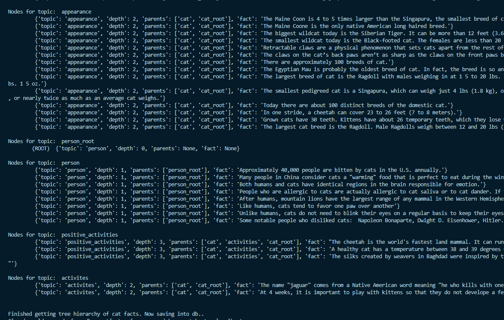
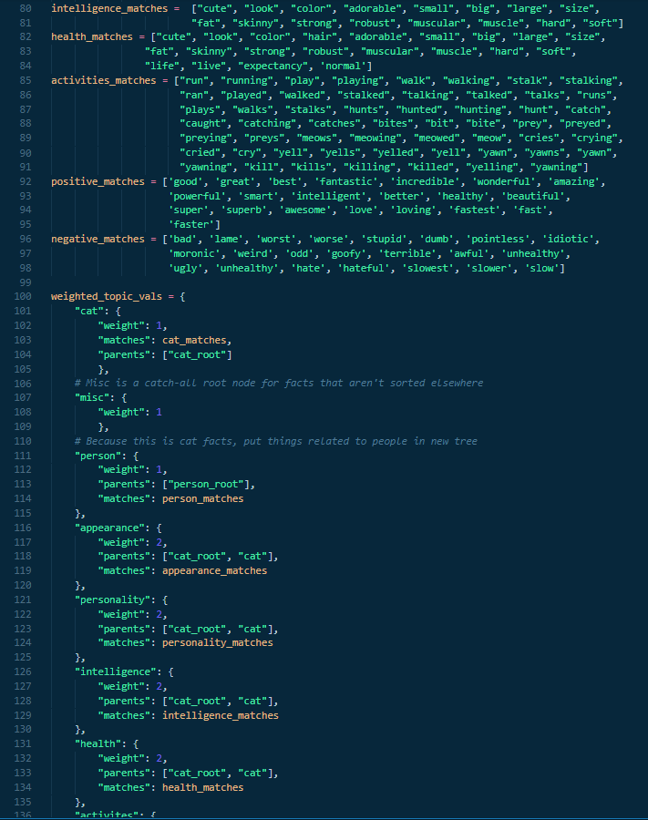

# Cat Facts Tree

This script demonstrates a simple way of automatically categorizing a list of texts (in this case, cat facts) into hierarchies that can be represented by trees. The logic creates a bag-of-words model with weights that correspond to node depth (hierarchical position), cross-referencing a pre-defined set of topics (hierarchy groups) with those associated weights. Each topic is also checked against a corresponding list of "matches", so any fact that contains words found to be a match for the topic would fall under that topic. 

Note: Due to lack of time, the tree structure created for the fact hierarchies is represented by a dictionary with the properties /  keys: depth, parents (parent nodes), and fact (payload content). The API returns a list of records that correspond to nodes containing these properties. From these values, an actual tree data structure class / library (with traversal functions, etc)containing the cat facts can be produced, but is not fully integrated here yet.

Once the cat facts are classified into hierarchies, the data is saved into PostgreSQL and accessible via a REST API for the enjoyment of all. 

# Screenshots



Results of the hierarchical tree classification of the cat facts.



Screenshot of how the data models were built that define how the weighted bag-of-words works, which eventually gives rise to hierarchical classifications based on the weights and topics (word tokens) found.

# Setup

## Pre-requisites

- Python 3

- Flask (for REST API)
```
pip install flask
```
- psycopg2 (PostgreSQL driver)

```
pip install psycopg2
```

## PostgreSQL setup

First, make sure PostgreSQL is installed and configured. The database connection by default will be localhost.

Start PostgreSQL and the CLI (When you're in the PostgreSQL dir).
```
psql -h localhost -U postgres
```

Then, in the CLI, create the database:

```
postgres=# CREATE DATABASE catfacts;
```

The quickest thing I found was just exiting the CLI and running this one command to make a user with access to the db (by default, the DB_USER var in thescript is set to my name, Johnny, which you can change accordingly):
```
psql -U postgres -c "CREATE ROLE Johnny LOGIN NOSUPERUSER INHERIT CREATEDB CREATEROLE;" catfacts
```

# Script / module usage

Running the main script will automatically hit Catfact.ninja's API, do analysis, and save the data into PostgreSQL with the configuration defined in the script's global vars.

```
python cat_facts_tree.py
```

You can also import import the modules as libraries to use, like this:
```
from cat_facts_tree import Cat_Facts_Tree, Cat_Facts_Tree_Records
cftr = Cat_Facts_Tree_Records()
cft = Cat_Facts_Tree
tree = cft.make_cat_facts_tree()
cft.save_to_db_clean(tree)
vals = [{"depth": 1, "topic": "cat", "fact": "Cats are amazing!"}]
cftr.create(vals)
print(cftr.fetch(["cat"]))
print(cftr.fetch())
```

# REST API Docs

To run the API, make sure Flask and all the dependencies are installed.

```
python cat_facts_tree_api.py
```

By default, it's served to localhost on port 8080.

##

Fetching data examples:

```
http://localhost:8080/api/get_cat_facts/cat,person/
```
returns a dictionary containing two fact hierarchies: cats, and people.

```
http://localhost:8080/api/get_cat_facts/all/
```
returns a dictionary of all fact hierarchies found in the database.

##

Writing data examples:

There's also an endpoint that allows you to write a new cat fact and save it as a node in the database with a POST request. The endpoint looks for an object payload with the key of "new_cat_facts", which should be a list of dictionaries. If only one new fact is being submitted, it should be the singular item in a list.

```
curl -i -X POST -H 'Content-Type: application/json' -d '{"new_cat_facts": [{"depth": "1", "parents": "cat_root", "fact": "Cats are amazing!"}]}' http://localhost:8080/api/write_new_cat_fact
```
creates a new with a depth of 1, root node being "cat_root", and "fact": "Cats are amazing!".